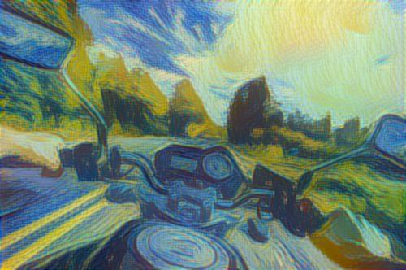
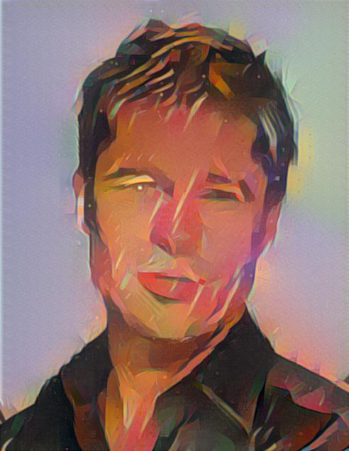

# Fast Patch-based Style Transfer of Arbitrary Style
Code for [arxiv link to be added].

Code is written in Torch and requires CUDA and cuDNN.

## Results

<div align='center'>
  
  
</div>

<div align='center'>
  
  
  
  
</div>

## Usage
Stylizing a single image:
```
th style-swap.lua --content images/content/bike.jpg --style images/style/starry_night.jpg
```

More options:
```
th style-swap.lua --help
```

eg. increase `--patchSize` for more abstract stylization
```
th style-swap.lua --content images/content/brad_pitt.jpg --style images/style/la_muse.jpg --patchSize 7 --patchStride 3
```

eg. use `--contentBatch` to stylize all images in a directory.
```
th style-swap.lua --contentBatch images/content --style images/style/starry_night.jpg
```

### Training an inverse network
```
th train-vgg-decoder.lua --contentDir /path/to/dir --styleDir /path/to/dir
```

More options:
```
th train-vgg-decoder.lua --help
```

For training the network in our paper, we used images from [MS COCO](http://mscoco.org/) and the [Painter by Numbers](https://www.kaggle.com/c/painter-by-numbers) competition hosted by Kaggle.

### Video
Frame-by-frame stylization can be done using the `-contentBatch` option. 

An example script using `ffmpeg` to extract frames, stylize, and re-encode a video.
```
mkdir video_frames
ffmpeg -i /path/to/video -qscale:v 2 video_frames/video_%04d.jpg
th style-swap --contentBatch video_frames --style /path/to/style/file --save stylized_frames
ffmpeg -i stylized_frames/video_%04d_stylized.jpg -c:v libx264 -pix_fmt yuv420p stylized_video.mp4
```

Examples of stylized videos are placed in the videos folder.
