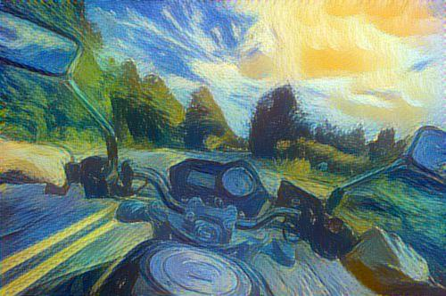
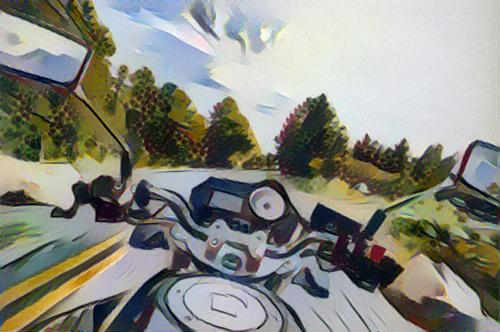
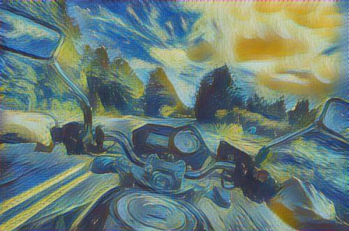
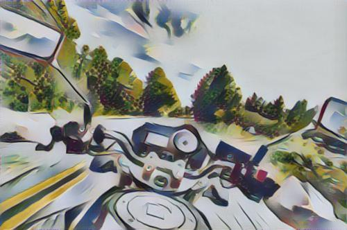
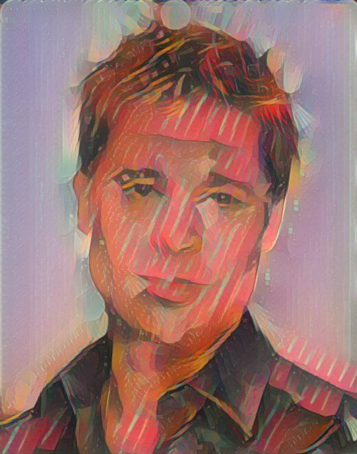
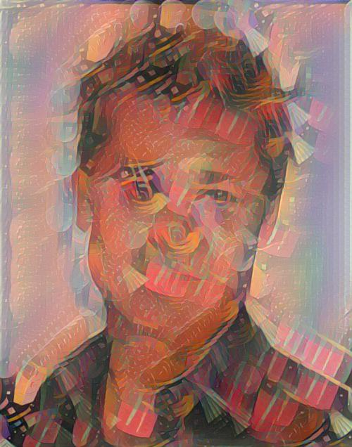
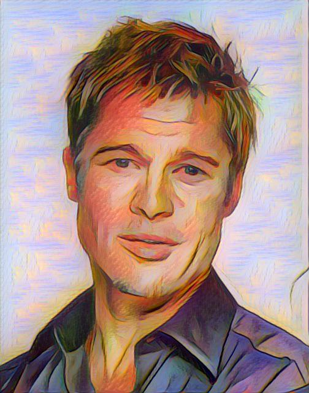
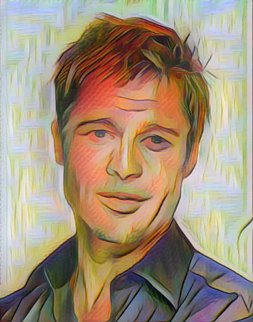
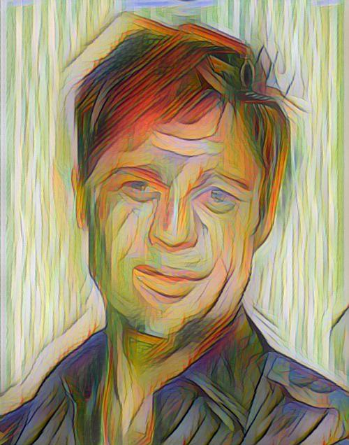

# Fast Patch-based Style Transfer of Arbitrary Style
Paper: https://arxiv.org/abs/1612.04337

Code is written in Torch. CUDA and CPU modes are available.

## Examples
<div align='center'>
  
  
  
</div>
(3x3 Patches) Content - w/ Starry Night - w/ Small Worlds I

<div align='center'>
  
  
  
</div>
with AvgPooling - using Inverse Network - using Inverse Network

<div align='center'>
  
  
  
  
</div>
(w/ Composition X) Original - 5x5 Patch - 9x9 Patch - 15x15 Patch

<div align='center'>
  
  
  
  
</div>
(w/ La Muse) Original - 3x3 Patch - 5x5 Patch - 9x9 Patch

## Download Pretrained VGG-19
```
git clone https://github.com/rtqichen/style-swap
cd style-swap/models
sh download_models.sh
cd ..
```

## Usage
Stylizing a single image:
```
th style-swap.lua --content images/content/bike.jpg --style images/style/starry_night.jpg
```

More options:
```
th style-swap.lua --help
```

eg. increase `--patchSize` for more abstract stylization
```
th style-swap.lua --content images/content/brad_pitt.jpg --style images/style/la_muse.jpg --patchSize 7 --patchStride 3
```

eg. use `--contentBatch` to stylize all images in a directory.
```
th style-swap.lua --contentBatch images/content --style images/style/starry_night.jpg
```

### Training an inverse network
```
th train-vgg-decoder.lua --contentDir /path/to/dir --styleDir /path/to/dir
```

More options:
```
th train-vgg-decoder.lua --help
```

For training the network in our paper, we used images from [MS COCO](http://mscoco.org/) and the [Painter by Numbers](https://www.kaggle.com/c/painter-by-numbers) competition hosted by Kaggle.

### Video
Frame-by-frame stylization can be done using the `-contentBatch` option.

An example script using `ffmpeg` to extract frames, stylize, and re-encode a video.
```
mkdir video_frames
ffmpeg -i /path/to/video -qscale:v 2 video_frames/video_%04d.jpg
th style-swap --contentBatch video_frames --style /path/to/style/file --save stylized_frames
ffmpeg -i stylized_frames/video_%04d_stylized.jpg -c:v libx264 -pix_fmt yuv420p stylized_video.mp4
```

Examples of stylized videos are placed in the videos folder. (Original video by [TimeLapseHD](https://www.youtube.com/watch?v=_xMz2SnSWS4).)

## Reducing GPU Memory Usage
A few ways to reduce memory usage for `style-swap.lua`:
- Decrease `--maxStyleSize` and `--maxContentSize`. The latter changes the size of the resulting image.
- Increase `--patchStride`. This extracts less patches to use for style swap. Best to use a larger `--patchSize` to ensure the patches still overlap.
- Last resort: use CPU-only mode by specifying `--cpu`. 
